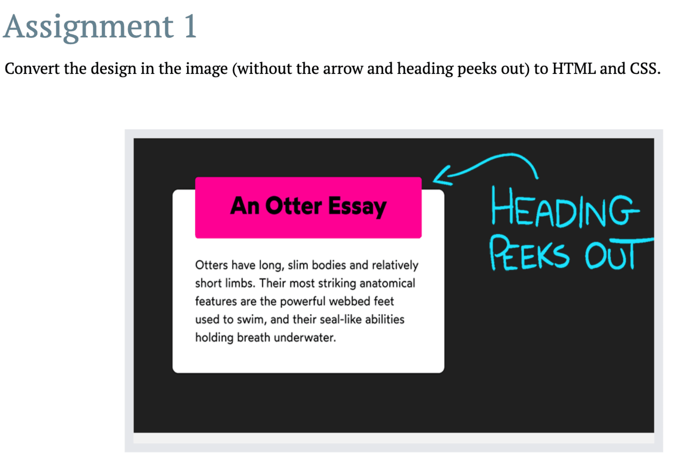
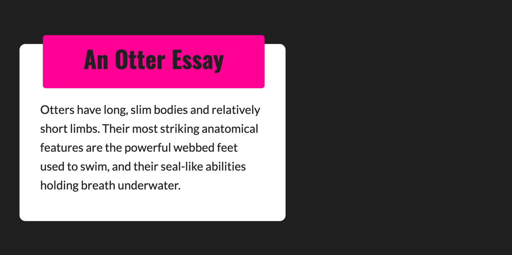

# Altschool Assignment CSS - A 6-Part assignment.

## Overview

This is a solution to my second semester assignment at Altschool Africa for my Front End Engineering Diploma. The assignment contains 6 pages built with HTML and styled with CSS. 

- `.index.html` - An assignment to test use of positioning in CSS.

### Built with

- Semantic HTML5 markup
- CSS custom properties

### Links